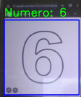

# Reconocimiento de Números - Python
Sistema de reconocimiento de números mediante inteligencia artificial, visión artificial y lógica difusa.

# Reconocimiento de Números

## Descripción

Este proyecto consiste en un sistema que genera una ventana capaz de reconocer números mostrados
en pantalla mediante técnicas de inteligencia artificial, procesamiento de
imágenes y lógica difusa.

El sistema analiza la información obtenida de la pantalla y utiliza lógica
difusa para interpretar y reconocer los números detectados por medio de
un modelo ya entrenado para reconocer formas del numero en la pantalla.

## Tecnologías utilizadas

- Python
- Lógica difusa
- Procesamiento de imágenes

### Librerías

- OpenCV: Procesamiento y análisis de imágenes
- NumPy: Manejo y procesamiento de arreglos numéricos.
- TensorFlow / Keras: Construcción, entrenamiento y uso de la red neuronal.
- Scikit-learn: División de los datos para el entrenamiento y prueba mediante train_test_split.
- OS: Manejo de archivos y directorios.

## Funcionamiento

El sistema sigue un proceso similar al siguiente:

1. Obtiene la imagen o región de la pantalla.
2. Procesa la imagen para identificar los elementos relevantes.
3. Analiza las características de los números.
4. Utiliza lógica difusa para realizar la interpretación.
5. Muestra el número reconocido.

## Ejemplo



## Ejecución

### 1. Instalar las dependencias

Clona el repositorio y entra a la carpeta del proyecto:

```bash
git clone https://github.com/JosePonceM/RN-Python.git
cd RN-Python
```

Instala las dependencias:

```bash
pip install -r requirements.txt
```

### 2. Entrenar el modelo

Ejecuta el entrenamiento del modelo:

```bash
python entrenamiento.py
```

El programa solicitará la ruta de la carpeta que contiene las imágenes:

```text
Escribe la ruta donde se encuentran las imágenes:
```

La carpeta `img_num` ya se encuentra en el repositorio y contiene las imágenes 
organizadas del 0 al 9, asi que simplemente copia el path de la carpeta.

Después, el programa solicitará la ruta donde se guardará el modelo:

```text
Escribe la ruta donde quieres guardar el modelo .keras:
```

### 3. Reconocer números

Una vez generado el modelo, ejecuta:

```bash
python reconocimiento.py
```

El programa solicitará la ruta del modelo entrenado:

```text
Ingresa la ruta donde el modelo buscará el modelo entrenado:
```

Introduce la ruta del archivo `.keras` generado durante el entrenamiento.

Se abrirá la cámara web y aparecerá un recuadro de detección. Coloca un número dentro del recuadro para que el modelo lo reconozca.

### 4. Cerrar el programa

Presiona **ESC** para cerrar la cámara y terminar el programa.
